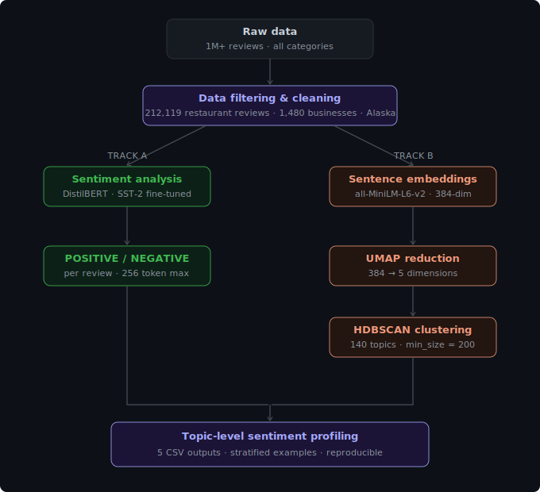
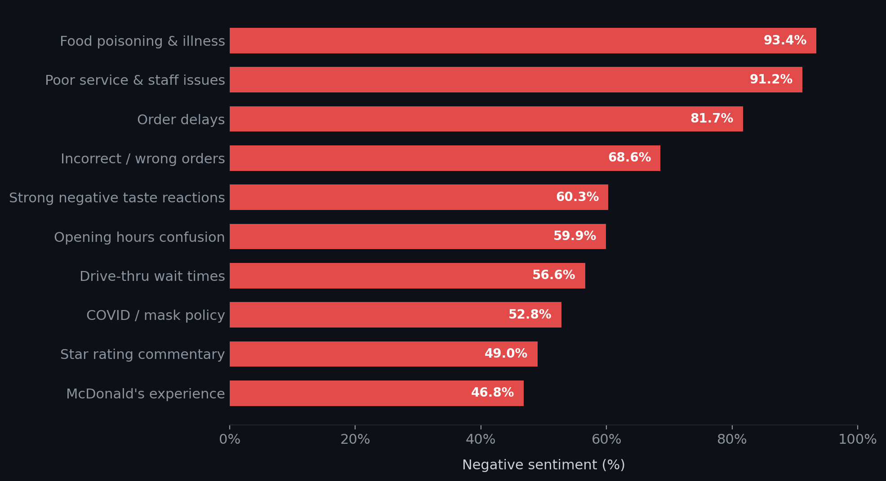
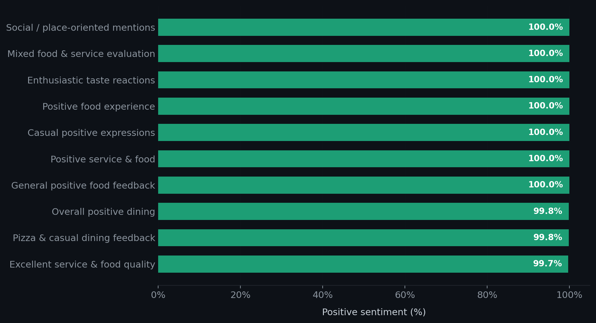
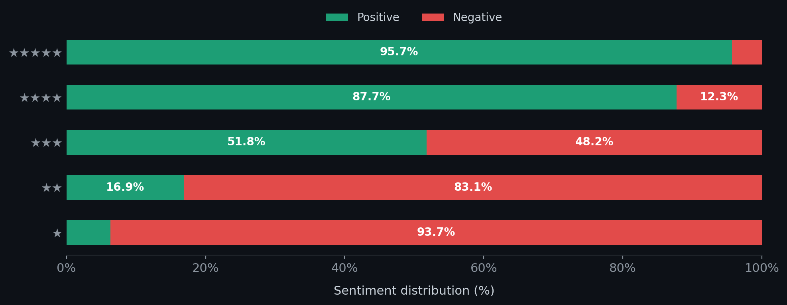

# What do People Write in Online Reviews?

### Sentiment Analysis & Topic Modelling of 212,000+ Restaurant Reviews

**Master's Thesis** · Hamburg University of Technology (TUHH) · February 2026
**Grade:** 2.3 · Study Programme: Mechanical Engineering and Management
**Supervisors:** Prof. Dr. Timo Heinrich · Prof. Dr. Christian Lüthje · Martin Sterner

---

## Overview

Star ratings compress rich customer experiences into a single number. This thesis asks: *what is actually being said?*

Using **212,119 Google Maps restaurant reviews** from Alaska, this project builds a dual-track NLP pipeline combining transformer-based sentiment classification with embedding-based topic modelling. The result: **140 semantically coherent discussion themes**, each profiled by sentiment, review volume, and star-rating alignment.

**Core finding:** Dissatisfied customers explain; satisfied customers affirm. Negative topics are tighter, more issue-specific, and richer in detail. Positive topics cluster around generalised praise — *"amazing," "delicious," "awesome."*

---

## Pipeline

<p align="center">
  
</p>

Sentiment analysis runs first — before topic modelling — so polarity labels are never influenced by topic-specific vocabulary. Topic modelling then groups reviews by semantic similarity using dense vector embeddings (not word counts), making it robust to short, informal review language.

---

## Key Results

> **Note:** BERTopic uses stochastic dimensionality reduction (UMAP) and density-based clustering (HDBSCAN), so topic assignments, topic counts, and sentiment distributions vary between runs — even with the same data and parameters. The results shown here are from one specific pipeline execution. The included CSV files correspond to this run.

### What drives dissatisfaction?

<p align="center">
  
</p>

Health and safety issues generate the most concentrated negative sentiment (93.4%), followed by interpersonal service conflicts (91.2%). Operational failures — wrong orders, long waits, confusing hours — form a consistent second tier. Negative topics are thematically sharp: customers who are unhappy explain *exactly* what went wrong.

### What drives satisfaction?

<p align="center">
  
</p>

Seven of the top ten positive topics hit 100% positive sentiment — but unlike negative reviews, satisfied customers rely on short affective language (*"awesome," "yummy," "loved it"*) without detailed explanation. This is the **positive–negative asymmetry**: dissatisfaction motivates explanation, satisfaction motivates affirmation.

### Do star ratings and text sentiment agree?

<p align="center">
  
</p>

Broadly yes, but not perfectly. The most striking divergence is at **3 stars**, which splits nearly 50/50 between positive and negative text. Star ratings and textual sentiment are related but not interchangeable — text adds interpretive depth that numbers alone cannot capture.

---

## Research Questions

| # | Question |
|---|----------|
| RQ1 | Which latent topics emerge from restaurant review text using BERTopic? |
| RQ2 | How is sentiment distributed across topics, and which themes show the highest positive or negative polarity? |
| RQ3 | To what extent does textual sentiment align with numerical star ratings? |

### Hypotheses & Outcomes

| Hypothesis | Result |
|---|---|
| H1: Reviews cluster into distinct recurring topics | ✅ 140 coherent topics identified |
| H2: Negative topics are more specific and explanatory than positive ones | ✅ Confirmed |
| H3: Textual sentiment aligns with star ratings but not perfectly | ✅ Strong correlation, notable mismatch at 3 stars |

---

## Technologies

| Component | Tool |
|---|---|
| Sentiment classification | `distilbert-base-uncased-finetuned-sst-2-english` |
| Sentence embeddings | `all-MiniLM-L6-v2` (SentenceTransformers) |
| Dimensionality reduction | UMAP |
| Clustering | HDBSCAN |
| Topic modelling | BERTopic |
| Data processing | Pandas, scikit-learn |
| Visualization | Matplotlib, Seaborn |
| Hardware acceleration | CUDA · Apple MPS · CPU (auto-detected) |

---

## Repository Structure

```
.
├── README.md
├── final_code_version.py        # Full analysis pipeline
├── generate_visuals.py          # Chart generation script
├── requirements.txt             # Python dependencies
├── data/
│   └── README.md                # Dataset download instructions
├── results/
│   ├── all_topics.csv                    # All 140 topics with sentiment stats
│   ├── sentiment_rating_correlation.csv  # Sentiment breakdown per star rating
│   ├── top_20_largest_topics.csv         # 20 largest topics with examples
│   ├── top_10_positive_topics.csv        # Most positive topics with examples
│   └── top_10_negative_topics.csv        # Most negative topics with examples
└── visuals/
    ├── pipeline.svg
    ├── negative_topics.png
    ├── positive_topics.png
    └── sentiment_rating_alignment.png
```

---

## Setup & Usage

### 1. Clone the repo

```bash
git clone https://github.com/Swarit786/restaurant-review-nlp.git
cd restaurant-review-nlp
```

### 2. Install dependencies

```bash
pip install -r requirements.txt
```

### 3. Download the dataset

See [`data/README.md`](data/README.md) for full instructions.

In short — download these two files from the [McAuley Lab](https://mcauleylab.ucsd.edu/public_datasets/gdrive/googlelocal/) and place them in the `data/` folder:

- `meta-Alaska.json` — business metadata
- `review-Alaska.json` — customer reviews

Both `.json` and `.json.gz` formats are supported.

### 4. Configure paths

Open `final_code_version.py` and set:

```python
META_PATH    = "data/meta-Alaska.json"
REVIEWS_PATH = "data/review-Alaska.json"
OUTPUT_DIR   = "results/"
```

### 5. Run the pipeline

```bash
python final_code_version.py
```

The pipeline auto-detects the fastest available device (CUDA → MPS → CPU).

| Hardware | Runtime |
|---|---|
| NVIDIA GPU (RTX 3060+) | 25–45 min |
| Apple Silicon (M2/M4) | 35–60 min |
| CPU only | 2–4 hours |

### 6. Regenerate visuals (optional)

```bash
python generate_visuals.py
```

---

## Methodology Notes

**Why sentiment before topic modelling?** Sentiment is an intrinsic property of each review, independent of thematic structure. Running it first ensures labels are unbiased by topic-specific vocabulary, enabling clean aggregation later.

**Why BERTopic over LDA?** LDA relies on word co-occurrence, which breaks down for short informal text. BERTopic uses contextual sentence embeddings — capturing semantic similarity even when vocabulary is sparse or varied.

**Multilingual handling:** Google Maps stores translated reviews as `(Translated by Google) <English> (Original) <source>`. The pipeline extracts only the English portion automatically.

**Redundant word refinement:** Inflected forms (*order / orders / ordering*) occupied multiple keyword slots without adding value. A targeted exclusion list was built through systematic inspection — affecting keyword representation only, not embeddings or clustering.

---

## Academic Context

**Institution:** Hamburg University of Technology (TUHH) · Institute W-5, Digital Economics
**Programme:** M.Sc. Mechanical Engineering and Management
**Submitted:** February 2026 · **Defended:** March 2026

---

## Dataset Citation

Yan, S., et al. (2023). *Personalized Showcases: Generating Multi-Modal Explanations for Recommendations.* Proceedings of the 46th International ACM SIGIR Conference. ACM.
https://mcauleylab.ucsd.edu/public_datasets/gdrive/googlelocal/

---

## Author

**Swarit Tiwari** · M.Sc. Mechanical Engineering & Management · TU Hamburg
[LinkedIn](https://linkedin.com/in/swarit-tiwari-942153171) · erswarittiwari@gmail.com
